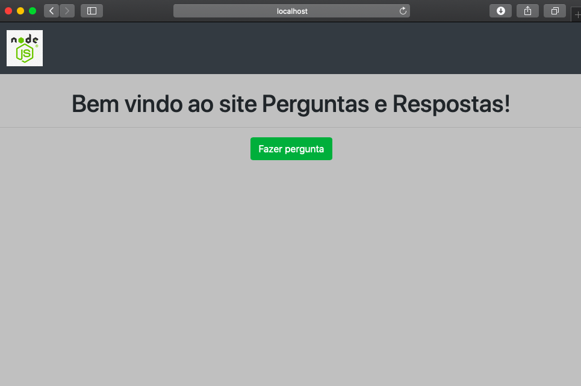
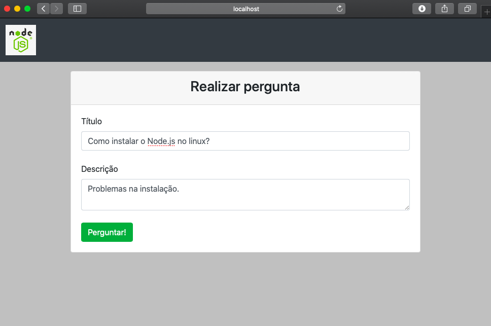
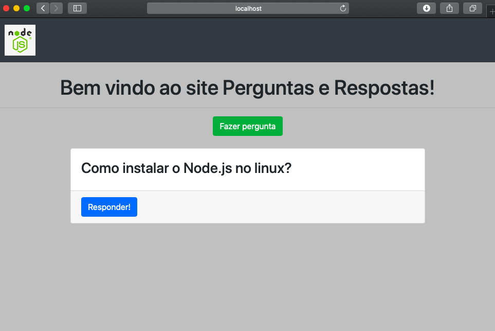
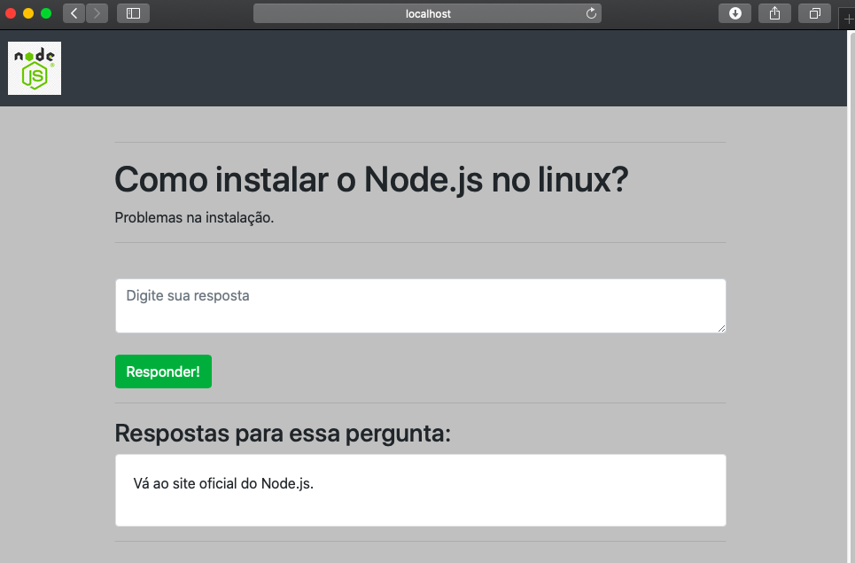

# Projeto do site Perguntas e Respostas

A proposta desse projeto é pôr em prática algumas tecnologias estudadas para o desenvolvimento *front-end* e *back-end* de uma aplicação *web*.
Ao longo desse documento serão relatadas quais linguagens/*frameworks*/ferramentas foram necessárias para a realização do *site*, assim como o funcionamento da aplicação.
A lista abaixo demonstra as tecnologias utilizadas:

* [Node.js](https://nodejs.org/en/)
* [Express.js](https://expressjs.com)
* [EJS](https://ejs.co)
* [Mysql](https://www.mysql.com)
* [Sequelize](https://sequelize.org)

# Interfaces da aplicação

Na página inicial da aplicação, demonstrada pela Figura 1, o usuário poderá visualizar todas as perguntas já criadas e, caso queira, através do botão *Fazer Pergunta* irá ser direcionado à uma outra interface onde poderá realizar uma pergunta.

  
  <h3 align="center"> Figura 1 - Tela inicial </h3>

A Figura 2 retrata a página destinada para a realização de perguntas. Sempre que o usuário criar uma questão o mesmo é redirecionado para a tela inicial.

  
  <h3 align="center"> Figura 2 - Realizar pergunta </h3>

Agora, após fazer alguma pergunta, todos podem vê-la na página inicial e respondê-la pressionando o botão *Responder* demonstrado na Figura 3.

  
  <h3 align="center"> Figura 3 - Perguntas realizadas </h3>

Por fim, o usuário pode responder e ao mesmo tempo visualizar todas as respostas para a questão escolhida conforme mostrado na Figura 4.

  
  <h3 align="center"> Figura 4 - Responder pergunta </h3>

